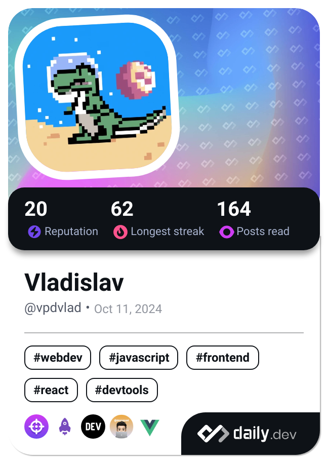

# 👋 Hello, I'm Vladislav Pak!

Welcome to my GitHub! I'm a passionate software developer with a focus on building web applications.

---

## 🚀 About Me
  
- 🌱 **Education:**
  - 🎓 Master of Computer Science (Westsächsischen Hochschule Zwickau) | *Oct 2021 - Jan 2025*
  - 🎓 Bachelor of Software Engineering (American University of Central Asia) | *Sep 2016 - May 2020*

- 💼 **Past Projects:**
  - At [GK Software](https://www.gk-software.com) as a Software Engineer, developed a **Language Server** from scratch, providing real-time code intelligence such as conditional   auto-completion using **TypeScript** and **Node.js**.
  - Contributed to the development of a university web application for the Faculty of Mechanical Engineering at WHZ.
  - Developed the frontend for a financial platform **EQMIS** at [Grand Systems](https://www.linkedin.com/company/grand-systems/) (ex Fortylines.io).
  - Built the website for a charitable foundation: [enebalagatirek.org](https://www.enebalagatirek.org).
  - Supported and integrated new features on the backend of Gazprom CRM (Kyrgyzstan) in [Askartec](https://askartec.com/).
  - In 2018 contribute to an online PvP mobile game on Unity [WarCars2](https://www.youtube.com/watch?v=wBhqHONNd2Y) (AFAIK Project was closed in 2022).

- 💻 **Tech Stack:**   

 
- 🌍 **Languages:**
  - English: Advanced
  - Russian: Native

### 📝 Additional info
> Besides coding, I’m deeply intrigued by the future of **Web3**, **cryptocurrency**, and **forex market**. I'm always on the lookout for new technologies that disrupt traditional systems.

